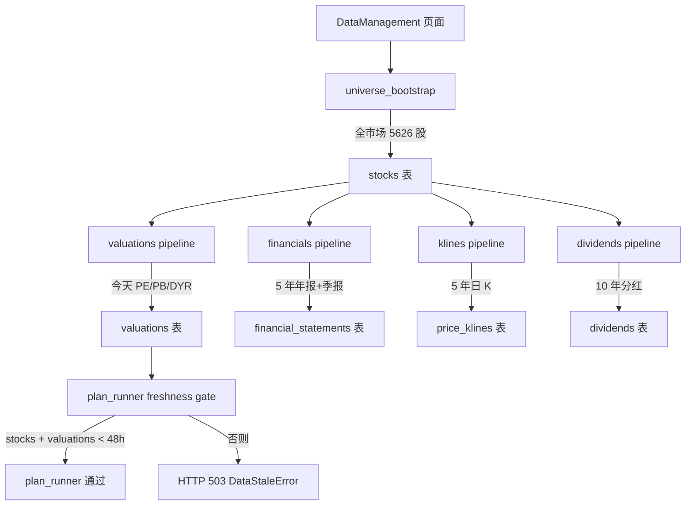
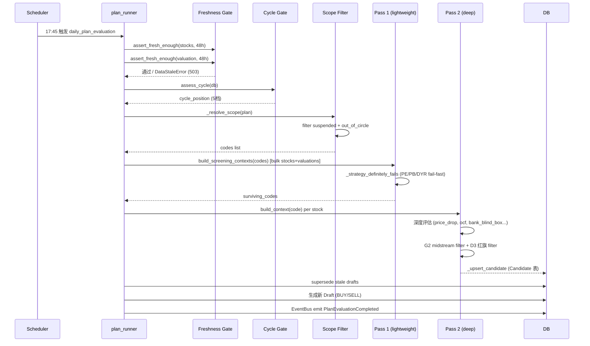
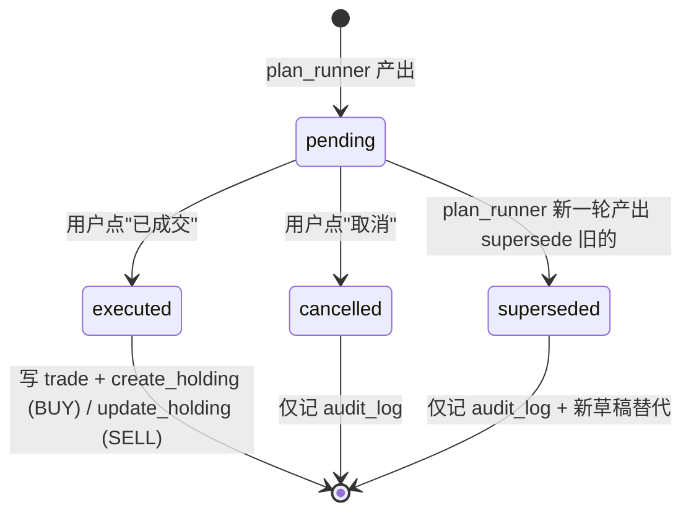
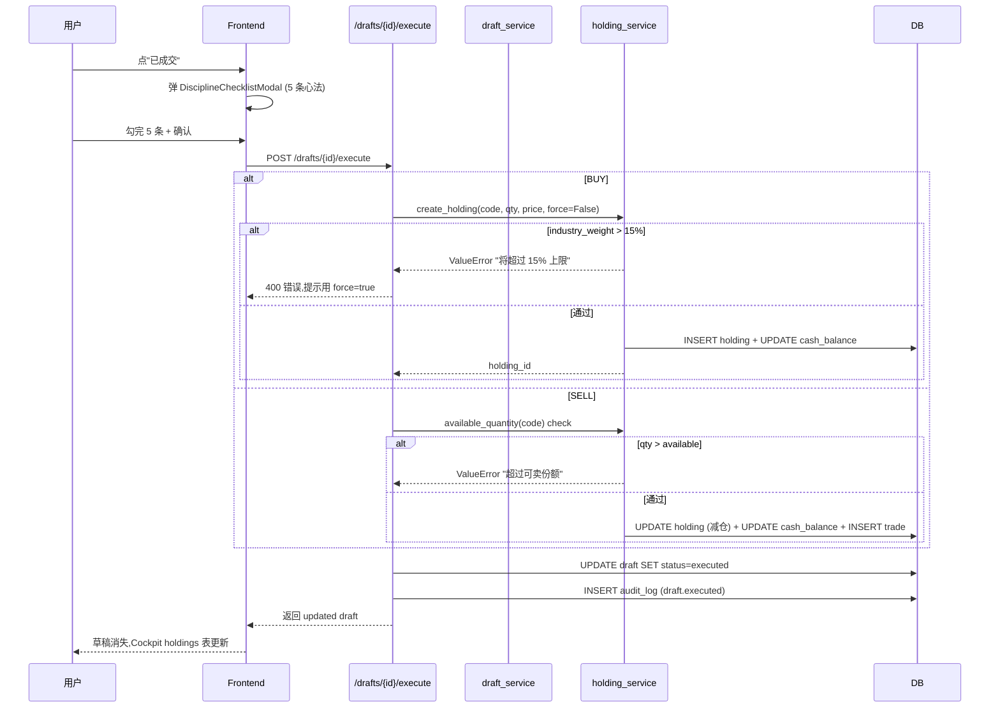

# Gojira — 个人股票自动驾驶舱

> 一台基于 `docs/reference/invest{1,2,3}.md` 投资体系的 A 股自动驾驶系统:从全市场扫描到候选池、订单草稿、持仓审计全流程自动化。**除真实券商下单外,筛选 / 监控 / 告警 / 订单草稿 / 再平衡 / 逻辑证伪全部自动**。
>
> **当前状态**: `v0.2-started` 🚀 (2026-06-18 21:06 wipe 进入 v0.2 起点)
> **测试**: 1189 passed / 0 failed
> **最新详细快照**: [`docs/progress/STATUS.md`](docs/progress/STATUS.md)

---

## 目录

### 第一部分:用户使用说明(主体)

1. [项目是什么](#1-项目是什么)
2. [启动与首次配置](#2-启动与首次配置)
3. [首次数据同步](#3-首次数据同步)
4. [看懂 Cockpit(主面板)](#4-看懂-cockpit主面板)
5. [理解 autopilot cron(自动调度)](#5-理解-autopilot-cron自动调度)
6. [看 candidates 候选池](#6-看-candidates-候选池)
7. [执行 drafts 草稿](#7-执行-drafts-草稿)
8. [看 holdings 持仓](#8-看-holdings-持仓)
9. [自定义策略与预案](#9-自定义策略与预案)
10. [月度复盘与 serenity 研究](#10-月度复盘与-serenity-研究)
11. [故障排查](#11-故障排查)

### 第二部分:开发者附录

- [附录 A:系统架构](#附录-a系统架构)
- [附录 B:API 参考](#附录-bapi-参考)
- [附录 C:开发者调试](#附录-c开发者调试)

---

## 1. 项目是什么

### 1.1 一句话定位

**Gojira** 是一台面向**中国 A 股市场**的「个人股票自动驾驶舱」。基于 `docs/reference/invest{1,2,3}.md` 描述的交易体系,把人脑里那些"找候选 / 等时机 / 下决策 / 跟踪持仓 / 证伪逻辑"的流程,改成机器自动跑。

具体做到什么:

```
策略组合 (Strategy)
  ↓ 组合
预案 (Plan) ── 扫描范围 + 调度 + 可选交易规则
  ↓ 自动产出
候选池 (Candidate) ── 自动进出 (rule_based | serenity)
  ↓
草稿 (Draft) ── 买卖建议 (BUY/SELL, 分批/止盈)
  ↓ 用户执行
持仓 (Holding) ── 仓位 / 行业集中度 / 论点变量监控
  ↓ 自动审计
审计日志 (AuditLog) + 论点告警 (SystemAlert)
```

**只缺一件事:不在券商真实下单。** 所有 order 是 paper draft,需要你手动到券商 APP 复刻。

### 1.2 技术栈

| 层 | 选型 | 备注 |
|---|---|---|
| 后端 | FastAPI (Python 3.14) + SQLAlchemy 2 + Pydantic v2 | `backend/app/` ~33k 行 + `tests/` ~20k 行 |
| 前端 | React 19 + TypeScript + Vite 6 + Ant Design 6 + ECharts 6 | `frontend/src/` ~18.5k 行 |
| 数据库 | SQLite + WAL 模式 | 单文件 `backend/data/gojira.db` ~200MB |
| 数据源 | [Lixinger 理杏仁](https://www.lixinger.com) | 唯一 A 股数据源,不接 Yahoo / Tushare / AkShare |
| LLM | 智谱 GLM (glm-4.7 默认) | 用于 serenity 研究模块,可选 |
| 调度 | APScheduler + Asia/Shanghai | 24 个 cron job,周一周五工作日跑 |
| 观测 | `@tracked` 装饰器 + 结构化 JSON 日志 | trace_id 全链路唯一 |

### 1.3 用户三原则(2026-06-13 锁定)

1. **除真实券商下单外全自动化** — 筛选 / 监控 / 告警 / 草稿 / 再平衡 / 逻辑证伪都自动
2. **架构尽可能简化** — 不引入 PostgreSQL / Redis / Docker / CI 等基础设施(过早优化)
3. **交易系统对齐 `docs/reference/invest{1,2,3}.md`** — 每个功能映射到投资理论原文

### 1.4 投资体系简述

完整的投资理论原文在 `docs/reference/invest{1,2,3}.md`(本地 gitignored,需要自行维护)。**核心 6 大模块**(Gojira 内置 6 策略对应):

| 投资理论 | Gojira 实现 |
|---|---|
| 选择权理论 (invest1 §二,原"求字理论") | `optionality_leader` 策略 + `power_tier` 字段 + `moat_leader` 预案 |
| 资源类硬资产 (invest3 §12) | `resource_hard_asset` 策略 + `resource_macro` 预案 |
| 高股息安全垫 (invest2 §23) | `high_dividend_cushion` 策略 + `core_value` 预案 |
| 银行业精选 (invest1 §5) | `bank_select` 策略 + `bank_anchor` 预案 |
| 现金流资产 (invest2 §7) | `cashflow_asset` 策略 |
| 超跌逆向 (invest1 §六) | `contrarian_oversold` 策略 + `contrarian_scan` 预案 |
| 心法闸门 (invest2 §23) | `DisciplineChecklistModal` 5 条 + `cockpit_service.psychology_alerts` |
| 能力圈 (invest3 §四层) | `Stock.in_circle` 字段 + plan_runner filter |
| 渣男换股 (invest1 附录) | thesis breach → EventBus → auto SELL draft + supersede |
| 周期定位 (invest3 §5) | `cycle_assessment_service` 沪深 300 PE 分位 → 5 档 |

详细映射见 [附录 A.6 功能 ↔ invest 章节映射](#a6-功能--invest-章节映射)。

### 1.5 内置 6 策略 + 4+2 预案

启动时 `builtin_seeder.py` 自动初始化。可在 `StrategiesPage` / `PlansPage` 查看 / 编辑 / 删除。

**6 策略**(原子筛选规则,可复用组合):

| 策略 | slug | 核心规则 |
|---|---|---|
| 高股息安全垫 | `high_dividend_cushion` | DYR≥4% & 分红可持续≥60 & OCF/NI≥0.8 |
| 低估值买入信号 | `undervalued_entry` | PE 分位≤30% & PB 分位≤30% |
| 资源类硬资产 | `resource_hard_asset` | 行业∈资源类 & DYR≥3% & 议价能力≥2 |
| 银行业精选 | `bank_select` | 银行 & DYR≥5% & 资产质量可见 & 优质区域 |
| 现金流资产 | `cashflow_asset` | OCF/NI≥1.0 & DYR≥4% & PE 分位≤50% |
| 超跌逆向机会 | `contrarian_oversold` | 跌幅≥20% & DYR≥4% & 分红可持续≥50% |

**6 预案**(策略组合 + 扫描范围 + 可选交易规则):

| 预案 | slug | 策略组合 | 扫描范围 | 交易规则 |
|---|---|---|---|---|
| 核心价值配置 | `core_value` | 高股息安全垫 + 低估值买入信号 | 全市场 | 分批建仓 / 30% 止盈 |
| 资源主线 | `resource_macro` | 资源类硬资产 + 高股息安全垫 | 资源行业 | 周期梯度 |
| 银行底仓 | `bank_anchor` | 银行业精选 | 银行业 | DYR 触发买卖 |
| 超跌逆向 | `contrarian_scan` | 超跌逆向机会 + 现金流资产 | 全市场 | 无(纯筛选) |
| 纯粹赚钱机器 | `pure_cash_machine` | 现金流资产 | 全市场 | DYR 触发 |
| 护城河龙头 | `moat_leader` | 选择权龙头 | 全市场 | power_tier 触发 |

### 1.6 项目路线图

详见 [`docs/active/roadmap.md`](docs/active/roadmap.md)。

| Milestone | 状态 | 含义 |
|---|---|---|
| `v0.1-paper-verified` | ✅ 完成 (2026-06-18) | autopilot 链路 paper 验证通过(scheduler 真触发 / plan_runner 真产出 / paper execute / 三防护验证) |
| `v0.2-started` | 🚀 当前 (2026-06-18 21:06 wipe) | 进入 v0.2 长期运行阶段。验收标准:**autopilot 跑通即 verified** (去期限化) |
| `v0.2-verified` | ⏳ pending (2026-06-19 17:45) | scheduler `daily_plan_evaluation` cron 触发首次 v0.2 run + 产出 candidates/drafts + audit_logs 沉淀 |
| `v1.0` | 远期 | 真实 broker 下单(券商 API 接入) |

---

## 2. 启动与首次配置

### 2.1 环境要求

| 依赖 | 版本 | 验证命令 |
|---|---|---|
| Python | 3.14+ | `python3 --version` |
| Node.js | 20+ | `node --version` |
| npm | 10+ | `npm --version` |
| SQLite | 3.40+ (内置) | `sqlite3 --version` |
| macOS / Linux | 任意 | `uname -a` |

不需要 Docker / PostgreSQL / Redis — 项目故意保持单机 SQLite 部署。

### 2.2 clone + 安装依赖

```bash
git clone <repo-url> gojira
cd gojira

# 后端依赖
cd backend
python3.14 -m venv .venv
source .venv/bin/activate
pip install -r requirements.txt

# 前端依赖
cd ../frontend
npm install
```

### 2.3 .env 配置(必填两个 token)

```bash
cd /path/to/gojira
cp .env.example .env
```

编辑 `.env`,填入真实 token:

| 字段 | 必填 | 获取方式 |
|---|---|---|
| `LIXINGER_TOKEN` | ✅ 必填 | [理杏仁官网](https://www.lixinger.com) 登录后 → 用户中心 → API Token |
| `ZHIPU_API_KEY` | 🔶 可选(serenity 研究用) | [智谱开放平台](https://open.bigmodel.cn/usercenter/apikeys) |
| `ZHIPU_MODEL` | 默认 `glm-4.7` | 可选 `glm-5.1` / `glm-5.2`(API 开放时) |
| `DATABASE_URL` | 默认 `sqlite:///data/gojira.db` | 单机不需要改 |
| `CORS_ORIGINS` | 默认 `["http://localhost:3000"]` | 单机不需要改 |

**验证 token 有效**:

```bash
cd backend && source .venv/bin/activate

# Lixinger token
python spikes/lixinger_token_verification.py
# 预期: 500 股返回,首条 "920126 永大股份"

# Zhipu API key
python spikes/glm_token_verification.py
# 预期: ping + structured 双 stage 通过
```

artifact 输出到 `backend/spikes/output/`,可保留作 baseline。

### 2.4 启动开发服务器

```bash
cd /path/to/gojira
./dev.sh
```

`dev.sh` 会:

1. **清理占用端口的孤儿进程**(避免上次 `--reload` 残留)— 自动 kill 占用 3000 / 3001 的进程
2. **跑 Alembic migration**(确保 DB schema 最新,head = `s10_1_in_circle_filter_default_off`)
3. **启动 backend** — `uvicorn app.main:app --reload --host 0.0.0.0 --port 3001`(PID 写到 `.dev-pids/backend.pid`)
4. **启动 frontend** — `npm run dev`(Vite, PID 写到 `.dev-pids/frontend.pid`)
5. **加载 scheduler jobs** — APScheduler 后台 daemon,加载 24 个 cron job 到 `scheduler_jobs` 表

预期看到:

```
[Migrate] Ensuring DB schema...
Schema ready.
[Clear] Killing orphan process on port 3001 (PID ...)
[Clear] Killing orphan process on port 3000 (PID ...)
Starting Gojira development environment...
[Backend]  starting on http://localhost:3001
[Frontend] starting on http://localhost:3000
```

打开浏览器 **http://localhost:3000** — 看到 Cockpit 主面板即成功。

### 2.5 验证健康

```bash
# 三层深度探针
curl http://localhost:3001/api/health
# 预期: {"status":"ok","checks":{"database":"ok","lixinger_token":"configured","zhipu_api_key":"configured"}}

# Zhipu 单独探针(serenity 研究用)
curl http://localhost:3001/api/health/zhipu
```

三个 `ok` = 完全就绪。`configured` ≠ `valid`,token 有效性需 spike 验证(见 2.3)。

### 2.6 常用命令速查

```bash
./dev.sh                  # 启动前后端(推荐)
./dev.sh status           # 查看服务状态
./dev.sh stop             # 停止所有服务

# 仅后端
cd backend && source .venv/bin/activate
uvicorn app.main:app --reload --host 0.0.0.0 --port 3001

# 仅前端
cd frontend && npm run dev

# 跑测试
cd backend && source .venv/bin/activate && pytest                    # 全套 1189 测试
pytest tests/test_pipeline.py                                          # 单文件
pytest -k "test_acquire_called_per_stock"                              # 单测试

# 前端构建检查
cd frontend && npm run build
cd frontend && npm run lint

# 跑 DB wipe(慎用,会清业务表)
cd backend && source .venv/bin/activate
python scripts/wipe_usage_data.py --dry-run    # 预演
python scripts/wipe_usage_data.py              # 真清(保留 Lixinger 数据 + seed config)
```

### 2.7 启动后第一件事

打开 **http://localhost:3000/data** — DataManagement 页面,确认 Lixinger 数据是否同步。如果还没同步,跳到 [第 3 章](#3-首次数据同步)。

---

## 3. 首次数据同步

### 3.1 同步流程总览



### 3.2 用 API 启动 pipeline(推荐)

最简单的全市场初始化方式 — 4 个 pipeline 全跑:

```bash
# 1. 全市场股票列表(universe_bootstrap 拉 Lixinger 全 A 股)
curl -X POST 'http://localhost:3001/api/data-management/pipeline/universe_bootstrap/start' \
  -H 'Content-Type: application/json' \
  -d '{"stock_codes": null}' 
# 预期: ~5s, 返回 {"run_id":"xxx", "stock_count": 5626}

# 2. 估值快照(全市场 PE/PB/DYR)
curl -X POST 'http://localhost:3001/api/data-management/pipeline/valuations/start' \
  -H 'Content-Type: application/json' \
  -d '{}' 
# 预期: ~60s, 5626 股 PE/PB/DYR 写入 valuations 表

# 3. 财报数据(年报 + 季报)
curl -X POST 'http://localhost:3001/api/data-management/pipeline/financials/start' \
  -H 'Content-Type: application/json' \
  -d '{"granularity": "q", "years": 5}' 
# 预期: ~90 min, 5626 股 × 20 季度

# 4. K线(日 K)
curl -X POST 'http://localhost:3001/api/data-management/pipeline/klines/start' \
  -H 'Content-Type: application/json' \
  -d '{"years": 5}' 
# 预期: ~3 hours, 5626 股 × 1250 天

# 5. 分红(可选,高股息策略需要)
curl -X POST 'http://localhost:3001/api/data-management/pipeline/dividends/start' \
  -H 'Content-Type: application/json' \
  -d '{"years": 10}' 
# 预期: ~3 hours, 5626 股 × 10 年
```

**重要参数**:

| 字段 | 类型 | 说明 |
|---|---|---|
| `stock_codes` | `list[str]` 或 `null` | `null` = 全市场 watched stocks(watchlist 中的);空数组会报错 |
| `force_full` | `bool` | `true` = 强制全量 backfill(忽略 checkpoint);`false` = 增量同步 |
| `years` | `int` (1-20) | 历史回溯年数,影响 Lixinger API 调用次数 |
| `granularity` | `"y"` / `"q"` / `null` | 仅 `financials` pipeline 用。`y` = 年报(默认), `q` = 季报 |

### 3.3 用 UI 启动 pipeline(可视化)

打开 **http://localhost:3000/data**,5 个 Tab:

| Tab | 用途 |
|---|---|
| 健康概览 | 各表新鲜度 / 死信队列 / 综合健康评分 |
| Pipeline 控制 | 启动 / 取消 / 查看 pipeline run 历史 |
| 股票池 | watched stocks 管理(决定 pipeline 默认范围) |
| 质量评估 | 数据完整性 / 缺失字段统计 |
| 数据清理 | 按 date range / stock_codes 清理旧数据 |

**Pipeline 控制 Tab** 启动步骤:
1. 选 pipeline 类型(valuations / financials / klines / dividends / universe_bootstrap)
2. (可选)填 stock_codes 列表 / force_full / years / granularity
3. 点"启动" — 立即返回 run_id,后台 daemon thread 执行
4. 在"运行历史"看 status / 进度 / summary

### 3.4 AdaptiveThrottler 节流(2026-06-19 修)

Pipeline 框架内置 throttler(`backend/app/services/pipelines/throttler.py`),每个 stock 之间 sleep `min_interval=0.2s`(5 RPS),错误率高时自动升到 `max_interval=2.0s`。**用途**:避免全速并发触发 Lixinger 429 限流。

实际速度参考(2026-06-19 实测):

| Pipeline | 范围 | 耗时 | 平均速度 |
|---|---:|---:|---:|
| universe_bootstrap | 全市场 5626 股 | ~5s | N/A(单 API call) |
| valuations | 全市场 5626 股 | ~60s | ~94 股/s(批量 API) |
| financials (年报) | 全市场 5626 股 | ~90 min | ~1 股/s |
| financials (季报) | 全市场 5626 股 × 9 季 | ~2h48m | ~0.6 股/s |
| klines | 全市场 5025 股 × 5 年 | ~2h34m | ~0.6 股/s |
| dividends | 全市场 5626 股 × 10 年 | ~3 hours | ~0.5 股/s |

### 3.5 监控 pipeline 进度

```bash
# 看最近 10 个 pipeline run
sqlite3 backend/data/gojira.db -header -column "
SELECT id, pipeline_type, status, total_items, completed_items, failed_items,
       started_at, finished_at
FROM pipeline_runs 
ORDER BY started_at DESC LIMIT 10;
"

# 看某 run 详情
sqlite3 backend/data/gojira.db -header -column "
SELECT * FROM pipeline_runs WHERE id='<run_id>';
"

# 看死信队列
sqlite3 backend/data/gojira.db -header -column "
SELECT pipeline_type, status, COUNT(*) 
FROM dead_letter_records 
GROUP BY pipeline_type, status;
"

# 看 data_freshness(决定 plan_runner freshness gate)
sqlite3 backend/data/gojira.db -header -column "
SELECT category, last_synced_at, last_success_at, last_record_count 
FROM data_freshness;
"
```

或 UI: **http://localhost:3000/data** → Pipeline 控制 → 运行历史。

### 3.6 已知限制(2026-06-19 实测)

详见 [`docs/progress/STATUS.md`](docs/progress/STATUS.md) §5.3 已知限制。

| ID | 限制 | 影响 |
|---|---|---|
| ~~L1 price_klines 仅 601/5626 股~~ | ✅ 2026-06-19 01:03 全量 backfill 完成 (5607/5626) | — |
| L2 corp_actions 表 0 行 | 公司行为从未同步 | 仅影响 backtest 准确性,不阻塞生产 |
| ~~L3 AdaptiveThrottler 死代码~~ | ✅ 2026-06-18 wire 完成 (`b6a148d`) | — |
| L4 dividends pipeline 6-18 00:50 FAILED | Lixinger 429 历史 | 已恢复,小批量调用 OK |
| L5 recover_stale_runs 10min race | long-running pipeline 中间状态被误标 failed | cosmetic,完成后 _execute_with_db 覆盖回真实状态 |
| L6 dead_letter 不自动 resolve on pipeline 重跑成功 | pipeline 重跑成功后旧 dead_letter 永远 pending | 需手动 SQL UPDATE 清理 |
| L7 api_usage_logs 表 0 行 | lixinger_client 未写日志 | DataManagement 页面"API 用量"显示 0 |
| L8 财报 pipeline 默认 granularity=y | 6 月缺 2026-Q1 季报 | 正在 backfill (`a6a3a66a`,预计 ~04:20 完成) |

---

## 4. 看懂 Cockpit(主面板)

打开 **http://localhost:3000**(根路由)进入 Cockpit 主面板。

### 4.1 整体布局

```mermaid
flowchart TB
    Cockpit[CockpitPage] --> GoalNav[🎯 Goal Navigator<br/>现金流目标进度]
    Cockpit --> Cycle[📊 Cycle Dashboard<br/>沪深300 周期位置]
    Cockpit --> ThemeExp[🌐 Theme Exposure<br/>行业暴露分析]
    Cockpit --> Serenity[🧠 Serenity Summary<br/>今日 LLM 研究]
    Cockpit --> PendingVars[⚠️ Pending Claims<br/>论点变量待审]
    Cockpit --> Rebalance[⚖️ Rebalancing<br/>再平衡建议]
    Cockpit --> DivProj[💰 Dividend Projection<br/>未来 12 月股息]
    Cockpit --> ThesisAlerts[🚨 Thesis Alerts<br/>论点越界告警]
    Cockpit --> Risk[📉 Portfolio Risk<br/>波动率/回撤/夏普]
    Cockpit --> Quadrant[🎯 Quadrant Pie<br/>象限分布]
    Cockpit --> Alerts[🔔 Alerts<br/>活跃告警事件]
    Cockpit --> Holdings[📋 Holdings<br/>持仓列表]
    Cockpit --> Plans[📅 Plans<br/>活跃预案]
    Cockpit --> PendingCorp[⚙️ Pending Corp Actions<br/>待处理公司行为]
```



### 4.2 各卡片详解

#### 4.2.1 Goal Navigator(目标导航仪)

最顶部的卡片。显示**现金流目标进度**:
- **goal_multiple**: 年开销的倍数(例如 10× 年开销)
- **goal_progress**: 当前进度百分比 = 总持仓 annual_passive_cashflow / target_annual_cashflow
- **weighted_dyr**: 持仓加权股息率,**目标 ≥ 4.5%**(invest2 §23)
- **total_portfolio_value**: 总持仓市值

**操作**: 点"设定目标"/"编辑目标"打开 CashflowGoalModal,设置 `target_annual_cashflow` 和 `goal_multiple`。

#### 4.2.2 Cycle Dashboard(周期仪表盘)

显示当前**沪深 300 周期位置**(invest3 §5):

| cycle_position | 含义 | 行为 |
|---|---|---|
| `extreme_low` | PE 分位 < 10% | 大胆加仓,banner 非阻塞提示 |
| `low` | 10% ≤ PE < 30% | 正常建仓 |
| `mid` | 30% ≤ PE < 70% | 中性,正常 |
| `high` | 70% ≤ PE < 90% | 谨慎,新开仓 blocker |
| `extreme_high` | PE ≥ 90% | 警告,极端高估,banner 提示 |

数据源: `cycle_assessment_service.assess_cycle(db)` 读 `valuations` 表沪深 300 成分股 PE 分位。

#### 4.2.3 Theme Exposure(行业暴露)

饼图 + 列表,显示持仓在各行业的暴露百分比。**红线**: 单一行业 > 15% (`MAX_INDUSTRY_WEIGHT`)。

#### 4.2.4 Today's Drafts(今日订单草稿)

autopilot 当天产出的 BUY / SELL 草稿列表,按 Qiu 评分降序。每行包含:

| 字段 | 含义 |
|---|---|
| 方向 | BUY (绿) / SELL (红) |
| 标的 | 股票代码 + 名称(点击进 StockDetail) |
| 评分 | `qiu_score`(选择权评分,invest1 §二) |
| 影响 | BUY: +组合 X% / SELL: −仓位 Y% + 可卖份额 |
| 触发原因 | 哪条策略 / 哪个论点变量触发 |
| 档位 | `[step_kind][step_index]`(分批建仓的第几档) |
| 操作 | "已成交" / "取消" |

**详情见 [第 7 章](#7-执行-drafts-草稿)**。

#### 4.2.5 Rebalancing Suggestions(再平衡建议)

`rebalance_service` 每周(周日 10:00)跑,产出:
- 已盈利超 +15% 的可减仓
- 亏损超 −10% 的需要复盘
- 行业集中度超 15% 的需分散

#### 4.2.6 Dividend Projection(股息预测)

`dividend_projector_service` 基于历史分红记录,预测未来 12 月的股息收入。**依赖**:dividends 表至少 3 年数据。

#### 4.2.7 Thesis Alerts(论点告警)

`thesis_monitor_service` 检查持仓的论点变量是否越界。例如:
- 银行股 NIM 持续 < 1.3% → 触发告警
- 资源股商品价格跌破阈值 → 触发告警

**严重告警**: 会自动生成 SELL draft(渣男理论,invest1 附录)。

#### 4.2.8 Portfolio Risk(组合风险)

`portfolio_risk_service` 从 `historical_klines` 推算:
- 年化波动率(σ)
- 30 日 / 90 日最大回撤
- 夏普比率代理

需要 historical_klines 数据(默认 6 股 backtest 用,持仓股可手动 backfill)。

#### 4.2.9 Quadrant Pie(象限分布)

把持仓按 DYR × PE 分位 分到 4 象限:
- 高 DYR + 低 PE = **核心配置**(理想区)
- 高 DYR + 高 PE = **持有观察**
- 低 DYR + 低 PE = **成长潜力**
- 低 DYR + 高 PE = **警示区**(考虑减仓)

#### 4.2.10 Holdings Table(持仓表)

所有当前持仓的详情列表:
- 股票代码 / 名称
- 持仓份额 / 成本 / 市值
- 浮盈亏 (pnl_pct)
- 行业 / tier (core / satellite)
- 加仓历史

**详情见 [第 8 章](#8-看-holdings-持仓)**。

#### 4.2.11 Plans List(预案列表)

当前活跃的预案 + 上次 run 时间 + 上次产出的候选数。

#### 4.2.12 Pending Corp Actions(待处理公司行为)

`daily_corp_action_apply` scheduler 每日 09:00 检查 `corp_actions` 表 `ex_date ≤ today` 的 pending 记录,应用到持仓(送股 / 拆股 / 派现)。

**注**: L2 known limitation — corp_actions 表当前 0 行,此卡片始终空。

### 4.3 psychology_alerts(心法强迫症检测)

`cockpit_service.psychology_alerts` 会扫描:
- **a 反复交易**: 同一股票 30 天内 ≥ 3 次交易 → 警告"频繁交易成瘾"
- **b 损失厌恶**: 浮亏 > −10% 但无任何操作 → 提醒"主动复盘"
- **c 锚定效应**: 持仓成本 vs 当前价差距大但交易理由空 → 提醒"勿锚定成本"

详见 `frontend/src/components/DisciplineChecklistModal.tsx` 5 条心法。

---

## 5. 理解 autopilot cron(自动调度)

### 5.1 调度架构

```mermaid
flowchart LR
    subgraph APScheduler[APScheduler daemon - Asia/Shanghai]
        J1[daily_universe_bootstrap<br/>15:00]
        J2[daily_base_sync<br/>15:15]
        J3[daily_snapshot<br/>17:00]
        J4[daily_cycle_assessment<br/>17:05]
        J5[daily_kline_sync<br/>17:15]
        J6[daily_prev_close_sync<br/>17:20]
        J7[alert_evaluation<br/>17:30]
        J8[thesis_evaluation<br/>17:32]
        J9[daily_plan_evaluation<br/>17:45]
        J10[daily_deep_sync<br/>18:00]
    end
    
    APScheduler -->|cron 触发| Jobs[job_executions 表]
    Jobs --> EventBus[EventBus 异步派发]
    EventBus --> Handlers[策略重评估 / 告警 / 审计]
```



### 5.2 完整 24 个 cron job 列表

按时间排序(Asia/Shanghai 周一-周五):

| 时间 | job_id | 用途 |
|---|---|---|
| `*/10 * * * *` | `research_stale_sweep` | 清理 stuck serenity research runs (GLM SSL hang 防御) |
| `*/15 * * * *` | `pipeline_stale_sweep` | 清理 stuck pipeline runs (后台 thread 死亡孤儿) |
| `*/5 9-14 * * 1-5` | `intraday_monitor` | 盘中价格监控(每 5 分钟,默认关闭) |
| `0 3 1 * *` | `monthly_dividend_sync` | 月度分红记录同步(每月 1 号 03:00) |
| `0 4 25-31 3,4,8,10 *` | `quarterly_financials_refresh` | 季报披露窗口刷新(3/4/8/10 月 25-31 日) |
| `0 8 * * 1` | `weekly_research_refresh` | 周一 08:00 自动刷新 serenity research 主题 |
| `0 9 * * 1-5` | `daily_corp_action_apply` | 工作日 09:00 应用 pending 公司行为 |
| `0 9 * * 1` | `weekly_dividend_sync` | 周一 09:00 持仓+关注+候选分红同步 |
| `0 10 * * 0` | `weekly_rebalancing_review` | 周日 10:00 再平衡检查 |
| `0 15 * * 1-5` | **`daily_universe_bootstrap`** | 工作日 15:00 全 A 股列表增量同步 |
| `15 15 * * 1-5` | `daily_base_sync` | 工作日 15:15 全量基础估值同步 |
| `5 17 * * 1-5` | `daily_cycle_assessment` | 工作日 17:05 沪深 300 PE/PB 分位 |
| `0 17 * * 1-5` | **`daily_snapshot`** | 工作日 17:00 PE/PB/股息率快照 |
| `15 17 * * 1-5` | **`daily_kline_sync`** | 工作日 17:15 日 K 同步(watched stocks) |
| `20 17 * * 1-5` | `daily_prev_close_sync` | 工作日 17:20 prev_close 同步(涨跌停校验) |
| `30 17 * * 1-5` | **`alert_evaluation`** | 工作日 17:30 告警规则评估 |
| `32 17 * * 1-5` | **`thesis_evaluation`** | 工作日 17:32 论点变量监控 |
| **`45 17 * * 1-5`** | **`daily_plan_evaluation`** | **工作日 17:45 预案自动评估(autopilot 核心)** |
| `0 18 * * 1-5` | `daily_deep_sync` | 工作日 18:00 候选股深度数据 |
| `30 4 * * 0` | `weekly_business_pattern_inference` | 周日 04:30 BusinessPattern 推断 |
| `30 4 1 * *` | `monthly_thesis_variable_sync` | 每月 1 号 04:30 论点变量同步 |
| `30 4 5 1,4,7,10 *` | `quarterly_shareholders_refresh` | 季度初 5 号股东数据刷新 |
| `*/5 9-14 * * 1-5` | `intraday_price_poll` | 盘中价格轮询(默认关闭) |

**关键 cron**:`daily_plan_evaluation` `45 17 * * 1-5` = 工作日 17:45 跑 plan_runner,这是 autopilot 主入口。

### 5.3 plan_runner 执行流程



### 5.4 freshness gate(数据新鲜度闸门)

`plan_runner.run_plan` 第一道关卡:

```python
for _category in ("stocks", "valuation"):
    assert_fresh_enough(db, _category, max_age_hours=48)
```

如果 stocks 或 valuation 的 `last_success_at` 距今 > 48h,直接 raise `DataStaleError` (HTTP 503),plan run 被拒绝。

**含义**: 节假日 / 周末 / 同步失败后,plan_runner 不会跑(避免基于过期数据生成 phantom drafts)。

### 5.5 手动触发 scheduler

UI: **http://localhost:3000/scheduler** — SchedulerPage。

或 API:

```bash
# 列所有 jobs + next_run_time
curl http://localhost:3001/api/scheduler/jobs

# 手动触发某 job
curl -X POST http://localhost:3001/api/scheduler/jobs/daily_plan_evaluation/run

# 看 job_executions 历史
sqlite3 backend/data/gojira.db -header -column "
SELECT job_id, status, started_at, finished_at, duration_ms, result_summary 
FROM job_executions 
ORDER BY started_at DESC LIMIT 20;
"
```

### 5.6 自动调度的 dependency

- **APScheduler 进程内 daemon** — backend 进程死了 scheduler 也死,所以必须 backend 跑着 scheduler 才会触发
- **Asia/Shanghai 时区** — 系统时区要正确(`date` 命令显示 CST)
- **watched stocks** — `daily_kline_sync` 等只同步 watchlist 中的股票;全市场同步要手动调 API

---

## 6. 看 candidates 候选池

打开 **http://localhost:3000/candidates** — CandidatesPage。

### 6.1 候选池概念

**Candidate** = plan_runner 扫描后通过策略筛选的股票,自动进出:

- **进**: plan_runner 评估通过 → `_upsert_candidate` 写入 `candidates` 表 (status=active)
- **出**: 下次 plan_runner 评估未通过 → status=removed

### 6.2 候选池字段

| 字段 | 含义 |
|---|---|
| stock_code | 股票代码 |
| stock_name | 名称 |
| plan_id | 来源预案 ID(serenity 来源可为 null) |
| plan_slug | 来源预案 slug |
| strategy_results | 命中的策略 + 评分细节 |
| source | `rule_based` (plan_runner 产出) / `serenity` (LLM 研究产出) |
| qiu_score | 选择权评分(invest1 §二) |
| status | `active` / `removed` |
| first_added_at | 首次进入候选池时间 |
| last_updated_at | 最近评估时间 |

### 6.3 7 个筛选条件(DataManagement 设计)

CandidatesPage 顶部 filter:

| 条件 | 类型 | 说明 |
|---|---|---|
| 关键字搜索 | text | 匹配 code / name |
| 行业 | select | 多选 |
| DYR 范围 | range | 例如 4% - 8% |
| PE 分位 | range | 例如 0% - 30% |
| Qiu 评分 | range | 例如 ≥ 60 |
| 来源 | select | rule_based / serenity / both |
| 状态 | select | active / removed / both |

### 6.4 API

```bash
# 列所有 active candidates
curl http://localhost:3001/api/candidates | jq .

# 按预案查
curl http://localhost:3001/api/plans/1/candidates | jq .

# 看某 candidate 详情
curl http://localhost:3001/api/candidates/123 | jq .

# promote_to_watchlist(进入 watchlist,后续 daily_kline_sync 会同步)
curl -X PUT http://localhost:3001/api/candidates/123 \
  -H 'Content-Type: application/json' \
  -d '{"promoted_to_watchlist": true}'

# 删除 candidate
curl -X DELETE http://localhost:3001/api/candidates/123
```

### 6.5 source: rule_based vs serenity

| source | 来源 | 触发 | 特点 |
|---|---|---|---|
| `rule_based` | plan_runner 自动扫描 | 17:45 cron | 机械规则,无 LLM 调用 |
| `serenity` | serenity 研究模块 | 手动 / 周一 08:00 cron | LLM 分析 + 三重硬约束 + structured claims |

CandidatesPage 有 source badge 区分。

---

## 7. 执行 drafts 草稿

打开 **http://localhost:3000/drafts** — DraftsPage。或 Cockpit 主面板"今日订单草稿"卡片。

### 7.1 草稿概念

**Draft** = 系统建议的买卖订单,**不是真实订单**,需要你手动到券商 APP 复刻。

| 字段 | 含义 |
|---|---|
| side | `BUY` / `SELL` |
| stock_code | 股票代码 |
| stock_name | 名称 |
| quantity | 建议数量(股) |
| buy_price / sell_price | 建议价格(元) |
| reason | 触发原因(策略名 / 论点变量) |
| qiu_score | 选择权评分 |
| step_kind / step_index | 分批建仓的档位(`accumulate[1]` / `accumulate[2]` / `take_profit[1]`) |
| source | `rule_based` (plan_runner) / `rebalance` / `serenity` / `thesis_breach` |
| status | `pending` / `executed` / `cancelled` / `superseded` |
| plan_id | 来源预案(thesis breach 可为 null) |

### 7.2 草稿状态机



### 7.3 执行流程(点"已成交")



### 7.4 三层防护(F30 验证通过)

执行 BUY draft 时,系统会强制三层检查:

| 防护 | 阈值 | 触发条件 | 绕过方式 |
|---|---|---|---|
| **价格 band** | ±15% around prev_close | 报价偏离 yesterday close 太多(可能是错误输入) | `force=true` query param |
| **Cash 不足** | buy_price × qty > cash_balance | 现金不够 | 充值 cash_balance(手动调) |
| **Industry cap** | industry_weight ≤ 15% (`MAX_INDUSTRY_WEIGHT`) | 单一行业仓位超限 | `force=true` query param |

```bash
# 普通执行(三层防护全启用)
curl -X POST http://localhost:3001/api/drafts/123/execute

# 强制执行(绕过 industry cap + 价格 band)
curl -X POST 'http://localhost:3001/api/drafts/123/execute?force=true'
```

### 7.5 DisciplineChecklistModal 5 条心法

每次执行 draft 前,弹窗强制勾选 5 条(invest2 §23 心法):

| # | 心法 | 含义 |
|---|---|---|
| a | **不反复交易** | 30 天内同股票 ≥ 3 次交易是成瘾信号 |
| b | **反损失厌恶** | 浮亏 > −10% 要主动复盘,不能鸵鸟 |
| c | **反锚定** | 不能因为"成本价"硬扛,要看当下价值 |
| d | **反追高** | 极端高位(extreme_high cycle)不新开仓 |
| e | **反情绪化** | 极端低位(extreme_low cycle)非阻塞 banner 提醒布局 |

不勾完 5 条无法 execute。

### 7.6 取消草稿

```bash
curl -X POST http://localhost:3001/api/drafts/123/cancel
# 状态: pending → cancelled,记 audit_log,不影响其他
```

### 7.7 supersede 逻辑

plan_runner 每次跑(17:45 cron),会:
1. 重新评估 candidates
2. 对比新旧 drafts
3. **旧的 pending drafts** 如果跟新方向冲突(例如旧的 BUY,新一轮 plan_runner 产出 SELL)→ status=`superseded`

避免 stale drafts 累积(2026-06-13 重审前的 bug: 296 候选股被静默吞掉,220 drafts 累积)。

### 7.8 thesis breach 自动 SELL(渣男理论)

`thesis_monitor_service` 检测到持仓论点变量越界(invest1 附录 "渣男理论"):
- 银行 NIM 持续 < 1.3%
- 资源股商品价格暴跌
- 财报红旗 (D3)

→ EventBus → `draft_service.create_thesis_breach_sell_draft(code)`:
1. 自动生成 SELL draft
2. supersede 该 stock 的所有 pending BUY drafts
3. audit_log 记录

**注**: thesis breach SELL draft 仍需用户手动 execute(不会真自动 SELL)。

---

## 8. 看 holdings 持仓

打开 **http://localhost:3000**(Cockpit 主面板)→ Holdings Table 卡片。或 API `/api/portfolio`。

### 8.1 持仓概念

**Holding** = 你当前持有的股票仓位。由 BUY draft execute 自动创建,或手动 API 添加。

| 字段 | 含义 |
|---|---|
| stock_code | 股票代码 |
| quantity | 持仓份额(股) |
| avg_cost | 加权平均成本(元/股) |
| current_price | 最新价(元/股)— 从 price_klines 取 |
| market_value | quantity × current_price |
| pnl_pct | (current_price − avg_cost) / avg_cost |
| industry | 行业(用于 industry cap) |
| tier | `core` / `satellite`(invest2 §四 Core-Satellite Model) |
| first_buy_at | 首次建仓时间 |
| last_updated_at | 最近更新 |

### 8.2 Portfolio Summary

`GET /api/portfolio/summary` 返回组合级指标:

| 字段 | 含义 |
|---|---|
| total_portfolio_value | 总市值 Σ market_value |
| total_cost | 总成本 Σ (quantity × avg_cost) |
| total_pnl | 总浮盈亏 |
| total_pnl_pct | 总浮盈亏百分比 |
| cash_balance | 现金余额 |
| weighted_dyr | 加权股息率(目标 ≥ 4.5%,invest2 §23) |
| annual_passive_cashflow | 未来 12 月预期股息 |
| industry_concentration | `{industry: weight_pct}` map |
| cycle_position | 当前周期位置 |

### 8.3 行业集中度 15% cap

```python
MAX_INDUSTRY_WEIGHT = 15  # invest2 §23: 单一行业不超过 15%
```

每次 BUY 时 `holding_service.create_holding` 检查:
- 计算加仓后该行业总 weight_pct
- 超过 15% → raise ValueError,需要 `force=true` 才能强行加

**purpose**: 防止单押某行业(例如满仓银行),系统性风险。

### 8.4 tier: core vs satellite

invest2 §四 Core-Satellite Model:
- **core** (核心仓位): 高股息 / 银行 / 资源类硬资产,长期持有,仓位上限 50% per stock
- **satellite** (卫星仓位): 选择权龙头 / 超跌逆向,中短期,仓位上限 10% per stock

仓位上限:
```python
MAX_SINGLE_BY_TIER = {
    'core': 0.50,      # 单只核心仓位 ≤ 50%
    'satellite': 0.10, # 单只卫星仓位 ≤ 10%
    None: 0.50,        # 未分类按 core 算
}
TOTAL_SATELLITE_MAX = 0.20  # 卫星总仓位 ≤ 20%
```

### 8.5 加仓 / 减仓 API

```bash
# 创建新持仓(BUY 等价)
curl -X POST http://localhost:3001/api/portfolio \
  -H 'Content-Type: application/json' \
  -d '{
    "stock_code": "600519",
    "quantity": 100,
    "avg_cost": 1800.00,
    "tier": "core"
  }'

# 加仓(已有持仓,quantity 累加,avg_cost 重算)
curl -X PUT http://localhost:3001/api/portfolio/123 \
  -H 'Content-Type: application/json' \
  -d '{"quantity": 200, "avg_cost": 1750.00}'

# 减仓(SELL)
curl -X POST http://localhost:3001/api/portfolio/123/sell \
  -H 'Content-Type: application/json' \
  -d '{"quantity": 50, "sell_price": 1900.00}'

# 查可卖份额(T+1 限制 + 已 pending SELL 占用)
curl http://localhost:3001/api/portfolio/600519/available
```

### 8.6 持仓审计层

| 事件 | 触发 | audit_log event_type |
|---|---|---|
| 创建持仓 | BUY draft execute / 手动 API | `holding.created` |
| 加仓 | PUT portfolio | `holding.updated` |
| 减仓 | SELL draft execute / sell API | `holding.sold` |
| 删除持仓 | DELETE portfolio | `holding.deleted` |
| 论点 breach | thesis_monitor 检测 | `thesis.breach` → 自动 SELL draft |

所有事件写入 `audit_logs` 表,可 UI 查或 API 查:

```bash
curl http://localhost:3001/api/audit-logs?stock_code=600519 | jq .
```

### 8.7 cash_balance 跟踪

`cash_balance` 表是单例(单行),跟踪可用现金:
- 初始: 100,000 元(可改,或 API 调整)
- BUY execute: `cash_balance -= buy_price × quantity`
- SELL execute: `cash_balance += sell_price × quantity`
- 手动调整: POST `/api/cash/adjust` (记录 `cash_adjustments` 表)

```bash
# 看当前现金
sqlite3 backend/data/gojira.db "SELECT * FROM cash_balance;"

# 看现金调整历史
sqlite3 backend/data/gojira.db -header -column "SELECT * FROM cash_adjustments ORDER BY adjusted_at DESC LIMIT 10;"
```

---

## 9. 自定义策略与预案

### 9.1 策略 (Strategy)

打开 **http://localhost:3000/strategies** — StrategiesPage。

#### 9.1.1 策略结构

| 字段 | 含义 |
|---|---|
| name | 策略名(中文,展示用) |
| slug | URL-safe 标识(英文,代码引用) |
| description | 策略描述 |
| rule_json | 核心规则 JSON(下面详解) |
| is_builtin | 是否内置(内置不可删,可改 rule_json) |

#### 9.1.2 rule_json schema

```json
{
  "op": "AND",  // AND / OR,组合多个 condition
  "conditions": [
    {
      "field": "dyr",
      "op": ">=",
      "value": 0.04
    },
    {
      "field": "pe_pct_10y",
      "op": "<=",
      "value": 0.30
    },
    {
      "field": "dividend_sustainability",
      "op": ">=",
      "value": 60
    }
  ]
}
```

#### 9.1.3 可用字段

`stock_context_builder.build_context()` 返回的 StockContext 字段:

| 字段 | 类型 | 来源 |
|---|---|---|
| `dyr` | float | valuations.dividend_yield |
| `pe_pct_10y` | float (0-1) | valuations.pe_percentile_10y / 100 |
| `pb_pct_10y` | float (0-1) | valuations.pb_percentile_10y / 100 |
| `price_drop_pct` | float | price_klines 跌幅计算 |
| `latest_close` | float | price_klines 最新 close |
| `52w_high` | float | price_klines 52 周最高 |
| `ocf_to_ni` | float | financial_statements OCF/NI |
| `forward_dyr` | float | Lixinger dyr × stability (3y 派息年数) |
| `dividend_sustainability` | int (0-80) | 3 因子评分 |
| `red_flag_count` | int | D3 红旗计数 |
| `bank_blind_box` | str | 银行盲盒 (bank_select 用) |
| `power_tier` | int (1-5) | 选择权位阶 (optionality_leader 用) |
| `industry` | str | stocks.industry |
| `tier` | str | stocks.tier (core / satellite) |
| `qiu_score` | int | stocks.qiu_score |
| `market_temp` | float | 市场温度 |

#### 9.1.4 创建策略

```bash
curl -X POST http://localhost:3001/api/strategies \
  -H 'Content-Type: application/json' \
  -d '{
    "name": "我的高股息",
    "slug": "my_high_dividend",
    "description": "DYR≥5% + 分红可持续≥70",
    "rule_json": {
      "op": "AND",
      "conditions": [
        {"field": "dyr", "op": ">=", "value": 0.05},
        {"field": "dividend_sustainability", "op": ">=", "value": 70}
      ]
    }
  }'
```

#### 9.1.5 单股测试

UI: StrategiesPage 每条策略行有"测试"按钮,输入 stock_code 看是否命中。

API:

```bash
curl -X POST http://localhost:3001/api/strategies/5/test \
  -H 'Content-Type: application/json' \
  -d '{"stock_code": "600519"}'
```

返回:
```json
{
  "passed": false,
  "matched_conditions": [],
  "failed_conditions": [
    {"field": "dyr", "op": ">=", "value": 0.05, "actual": 0.024},
    {"field": "dividend_sustainability", "op": ">=", "value": 70, "actual": 35}
  ],
  "context_snapshot": {...}
}
```

### 9.2 预案 (Plan)

打开 **http://localhost:3000/plans** — PlansPage。

#### 9.2.1 预案结构

| 字段 | 含义 |
|---|---|
| name | 预案名 |
| slug | URL-safe 标识 |
| status | `active` / `paused` |
| strategy_composition_json | 策略组合 + AND/OR |
| scan_scope_json | 扫描范围 |
| schedule_cron | 调度 cron(覆盖默认 daily_plan_evaluation) |
| trading_rules_json | 可选交易规则(分批/止盈/DYR 触发) |
| disable_midstream_filter | bool(逃生口,默认 false) |
| disable_in_circle_filter | bool(逃生口,默认 true=不筛选能力圈) |
| cycle_buy_max | `low`/`mid`/`high`(周期限制) |

#### 9.2.2 strategy_composition_json

```json
{
  "strategy_ids": [1, 2],
  "op": "AND",
  "weights": { "1": 0.6, "2": 0.4 }
}
```

`op` 决定多个策略怎么组合:
- `AND`: 所有策略必须命中
- `OR`: 任一策略命中即可

#### 9.2.3 scan_scope_json

```json
// 全市场
{"type": "all_stocks", "values": []}

// 按行业
{"type": "industries", "values": ["银行", "bank"]}

// 按股票代码
{"type": "stocks", "values": ["600519", "000001"]}
```

#### 9.2.4 trading_rules_json(可选)

```json
{
  "buy": {
    "strategy": "accumulate",  // 分批建仓
    "steps": [
      {"index": 1, "pct_of_target": 0.30, "trigger": "first_pass"},
      {"index": 2, "pct_of_target": 0.30, "trigger": "price_drop_5pct"},
      {"index": 3, "pct_of_target": 0.40, "trigger": "price_drop_10pct"}
    ]
  },
  "sell": {
    "strategy": "take_profit",
    "steps": [
      {"index": 1, "pct_of_position": 0.30, "trigger": "pnl_15pct"},
      {"index": 2, "pct_of_position": 0.30, "trigger": "pnl_30pct"},
      {"index": 3, "pct_of_position": 0.40, "trigger": "pnl_50pct"}
    ]
  }
}
```

#### 9.2.5 创建预案

```bash
curl -X POST http://localhost:3001/api/plans \
  -H 'Content-Type: application/json' \
  -d '{
    "name": "我的预案",
    "slug": "my_plan",
    "status": "active",
    "strategy_composition_json": {
      "strategy_ids": [1, 2],
      "op": "AND"
    },
    "scan_scope_json": {"type": "all_stocks", "values": []},
    "schedule_cron": "45 17 * * 1-5",
    "trading_rules_json": null
  }'
```

#### 9.2.6 手动 run 预案

UI: PlansPage 每条预案行有"运行"按钮。

API:

```bash
# 触发某 plan 立即跑(不等 cron)
curl -X POST http://localhost:3001/api/plans/3/run

# 看 plan 当前 candidates
curl http://localhost:3001/api/plans/3/candidates | jq .
```

返回:
```json
{
  "plan_id": 3,
  "plan_name": "资源主线",
  "scanned": 245,
  "passed": 12,
  "filtered_out_of_circle": 5,
  "filtered_midstream_non_leader": 3,
  "filtered_red_flags": 2,
  "cycle_unavailable_skipped": false,
  "errors": []
}
```

#### 9.2.7 6 内置预案对比

| 预案 | 适合场景 | 仓位策略 | 注意 |
|---|---|---|---|
| `core_value` | 长期价值投资 | 分批建仓 + 30% 止盈 | 默认起点 |
| `resource_macro` | 顺周期资源主线 | 周期梯度 | 跟踪商品价格 |
| `bank_anchor` | 银行底仓 | DYR 触发 | 银行盲盒数据 |
| `contrarian_scan` | 超跌逆向 | 无(纯筛选) | 高波动 |
| `pure_cash_machine` | 现金流优先 | DYR 触发 | 稳健 |
| `moat_leader` | 选择权龙头 | power_tier 触发 | 高成长 |

---

## 10. 月度复盘与 serenity 研究

### 10.1 月度复盘 (Review)

打开 **http://localhost:3000/review** — ReviewPage。

#### 10.1.1 月度复盘流程

每月 1 号(或手动触发)`periodic_review_service` 产出:
- 上月持仓表现(pnl_pct / 行业 / tier 分布)
- 命中策略统计(哪些策略最准)
- 错过的候选( removed candidates 中后续涨多少)
- 论点变量趋势(哪些 breach 了)

#### 10.1.2 API

```bash
# 看历史复盘
curl 'http://localhost:3001/api/review?year=2026&month=5' | jq .

# 触发本月复盘(管理员)
curl -X POST http://localhost:3001/api/review/generate \
  -H 'Content-Type: application/json' \
  -d '{"year": 2026, "month": 6}'
```

### 10.2 serenity 研究

打开 **http://localhost:3000/research** — ResearchThemesPage。

#### 10.2.1 serenity 是什么

**serenity** = 用 LLM(GLM)系统化研究某个行业 / 主题:
- 输入:研究主题(例如"银行业资产质量")
- LLM 调用:Web Search + 三重硬约束 + structured claims 输出
- 产出:价值链层级 / 稀缺层 / 公司排名 / 论点变量 / 失败条件

**用途**:产出非机械规则的候选(`candidates.source=serenity`)。

#### 10.2.2 7 张研究表

| 表 | 内容 |
|---|---|
| research_themes | 研究主题(例如"银行业资产质量") |
| research_runs | 单次 LLM 调用记录(token / 时长 / 状态) |
| value_chain_layers | 价值链层级(上游 / 中游 / 下游) |
| scarce_layers | 稀缺层(议价能力强的环节) |
| research_company_universe | 公司清单(LLM 选出的标的) |
| research_company_ranking | 公司排名 |
| research_evidence | 证据(URL + 摘要) |
| research_claims | structured claims(subject/predicate/signal/outcome/stock_codes/layer_index) |

#### 10.2.3 创建研究主题

UI: ResearchThemesPage "新建主题"按钮。

API:

```bash
curl -X POST http://localhost:3001/api/research/themes \
  -H 'Content-Type: application/json' \
  -d '{
    "name": "银行业资产质量",
    "description": "NIM / 不良率 / 拨备覆盖率 跨周期对比",
    "auto_refresh_freq": "weekly"
  }'
```

#### 10.2.4 触发研究 run

```bash
# 同步触发(等 LLM 跑完)
curl -X POST http://localhost:3001/api/research/themes/1/run \
  -H 'Content-Type: application/json' \
  -d '{}'

# 异步触发(立即返回 run_id,后台 ThreadPoolExecutor)
curl -X POST http://localhost:3001/api/research/themes/1/run?async=true \
  -H 'Content-Type: application/json' \
  -d '{}'
```

预计 5-15 分钟(GLM 调用 + Web Search + structured 输出)。

#### 10.2.5 三重硬约束(Q13)

LLM 调用前的硬约束,任一不满足直接拒绝跑:
1. **token 预算**: `SERENITY_MAX_TOKENS=16000` per run
2. **search 次数**: `SERENITY_MAX_SEARCHES=30` per run
3. **timeout**: `SERENITY_TIMEOUT=300s`

月度 token 预算软上限:`SERENITY_MONTHLY_BUDGET_CNY=100`(超了发警告,不阻断)。

#### 10.2.6 structured claims → thesis variables

LLM 输出的 structured claims 会自动转译为论点变量,供 `thesis_monitor_service` 监控:

```json
{
  "subject": "工商银行",
  "predicate": "NIM",
  "signal": "lt 1.3",
  "outcome": "持续两个季度",
  "stock_codes": ["601398"],
  "layer_index": 2
}
```

转译后:`thesis_variables` 表写入 `{"stock_code":"601398", "variable":"NIM", "breach_when":"lt", "threshold":1.3, "window":"2q"}`。

监控越界时:`thesis_evaluation` cron (17:32) → 触发 thesis breach → 自动 SELL draft(渣男理论)。

#### 10.2.7 历史 Run diff 视图

打开 ResearchThemeDetailPage → 历史 Tab,可选两个 run 对比:
- ranking_diff(公司排名变化)
- claims_diff(structured claims 变化)
- scarce_layers_diff(稀缺层变化)

#### 10.2.8 LLM 调用故障排查

| 症状 | 根因 | 修复 |
|---|---|---|
| Run 一直 pending | GLM SSL hang | `research_stale_sweep` 每 10 分钟清理(F23) |
| Run failed | token 超额 | 调高 `SERENITY_MAX_TOKENS` 或简化 prompt |
| Run failed | search 超额 | 调高 `SERENITY_MAX_SEARCHES` |
| Run failed | timeout | 调高 `SERENITY_TIMEOUT` |
| 没产出 claims | LLM 没按 schema 输出 | 检查 `backend/data/llm_logs/` 看原始输出 |

LLM 原始输出 dump 在 `backend/data/llm_logs/{run_id}.json`,可 debug。

---

## 11. 故障排查

### 11.1 三层健康探针

```bash
curl http://localhost:3001/api/health
```

返回:
```json
{
  "status": "ok",
  "checks": {
    "database": "ok",
    "lixinger_token": "configured",
    "zhipu_api_key": "configured"
  }
}
```

| check | ok 含义 | failed 含义 |
|---|---|---|
| database | DB 可连接 + schema 最新 | 检查 SQLite 文件 / 跑 alembic migration |
| lixinger_token | .env 配了 token | .env 缺 LIXINGER_TOKEN |
| zhipu_api_key | .env 配了 GLM key | serenity 研究不可用,其他功能正常 |

**注意**: `configured` ≠ `valid`。token 有效性要 spike 验证:

```bash
cd backend && source .venv/bin/activate
python spikes/lixinger_token_verification.py  # 验证 Lixinger
python spikes/glm_token_verification.py       # 验证 GLM
```

### 11.2 DataManagement 页面诊断

打开 **http://localhost:3000/data**,5 Tab:

| Tab | 看什么 |
|---|---|
| 健康概览 | 各表新鲜度 / 综合评分 / 死信队列 |
| Pipeline 控制 | pipeline_runs 状态 / 失败原因 |
| 股票池 | watched stocks 数量 |
| 质量评估 | 数据缺失统计 |
| 数据清理 | 清理旧数据 |

### 11.3 常见症状 → 根因 → 修复

#### 11.3.1 症状: Cockpit 主面板显示 "数据陈旧"

**根因**: `valuations.last_success_at` 距今 > 48h。

**修复**:
```bash
# 手动跑 valuation pipeline
curl -X POST http://localhost:3001/api/data-management/pipeline/valuations/start \
  -H 'Content-Type: application/json' -d '{}'

# 或等 17:00 daily_snapshot cron 自动跑
```

#### 11.3.2 症状: plan_runner 跑了但没产出 candidate

**可能根因**:
1. **cycle_unavailable_skipped**: cycle_assessment 拿不到沪深 300 PE 分位 → 等估值数据同步
2. **filtered_out_of_circle**: 所有股票都被能力圈 filter 过滤 → 改 plan `disable_in_circle_filter=true`
3. **filtered_midstream_non_leader**: 中游非龙头被过滤 → 改 plan `disable_midstream_filter=true`
4. **filtered_red_flags**: 红旗过滤 → 检查红旗是否合理(`dividend_sustainability` 是否计算正确)
5. **strategy 太严**: 测试单股 `POST /api/strategies/{id}/test` 看哪些 condition fail

#### 11.3.3 症状: pipeline status=failed 但实际数据在涨

**根因**: L5 known limitation — `recover_stale_runs` 10min 阈值 race,long-running pipeline 中间被误标 failed,完成后 _execute_with_db 会覆盖回真实状态。

**判断方法**:
```bash
# 看 price_klines / financial_statements 实际是否有新插入
sqlite3 backend/data/gojira.db "
SELECT COUNT(*) FROM price_klines 
WHERE created_at > datetime('now', '-30 seconds');
"
# > 0 = 实际在跑,ignore status=failed
```

#### 11.3.4 症状: pipeline dead_letter 累积

**根因**: Lixinger 429 / circuit breaker / data_anomaly。

**修复**:
```bash
# 看死信原因分布
sqlite3 backend/data/gojira.db -header -column "
SELECT error_type, substr(error_message, 1, 100) AS msg, COUNT(*) AS cnt
FROM dead_letter_records 
WHERE status='pending'
GROUP BY error_type, substr(error_message, 1, 100)
ORDER BY cnt DESC;
"

# 如果是 "Circuit open for Lixinger" → 等 5 分钟 reset window
# 如果是 "API returned 429" → 同上
# 如果是 "data_anomaly" → 看具体 stock,可能是数据格式异常

# 清理已重试成功的 dead_letter(L6)
sqlite3 backend/data/gojira.db "
UPDATE dead_letter_records 
SET status='resolved' 
WHERE status='pending' AND created_at < '<cutoff_datetime>';
"
```

#### 11.3.5 症状: 执行 BUY draft 报 "industry 超过 15%"

**根因**: F30 三层防护触发 industry cap。

**修复**:
- 真的超过 → 取消 draft / 换行业
- 强行加仓 → `POST /api/drafts/{id}/execute?force=true`

#### 11.3.6 症状: serenity research 一直 pending

**根因**: GLM SSL hang (F23/F26)。

**修复**:
```bash
# 手动触发 sweep
curl -X POST http://localhost:3001/api/scheduler/jobs/research_stale_sweep/run

# 或等 */10 分钟 cron 自动 sweep
```

#### 11.3.7 症状: 前端 401 / CORS 错误

**根因**: backend 没启动 / CORS_ORIGINS 不含 localhost:3000。

**修复**:
```bash
./dev.sh status  # 确认 backend + frontend 都 running
cat .env | grep CORS  # 应该包含 http://localhost:3000
```

#### 11.3.8 症状: backend `--reload` 后端口被占

**根因**: 旧 uvicorn 进程没干净退出。

**修复**: dev.sh 现已自带 clear_port 函数自动 kill 孤儿进程。如果手动起的话:
```bash
lsof -ti :3001 | xargs kill -9
lsof -ti :3000 | xargs kill -9
```

### 11.4 日志位置

| 日志 | 位置 |
|---|---|
| Backend stdout | `.dev-logs/backend.log` |
| Frontend stdout | `.dev-logs/frontend.log` |
| LLM 调用 dump | `backend/data/llm_logs/{run_id}.json` |
| Spike artifacts | `backend/spikes/output/*.json` |
| DB backups | `backend/data/backups/*.db` (gitignored) |
| Scheduler 历史 | `job_executions` 表 |
| Pipeline 历史 | `pipeline_runs` 表 |
| Audit log | `audit_logs` 表 |

### 11.5 观测性(trace_id)

所有 backend 函数都被 `@tracked` 装饰器自动埋点(158 个函数)。每次 API 调用生成 `trace_id`,跨函数透传。

```bash
# 看 trace
curl 'http://localhost:3001/api/observability/traces?trace_id=<xxx>'

# 看 span
curl 'http://localhost:3001/api/observability/spans?trace_id=<xxx>'

# 看事件
curl http://localhost:3001/api/observability/events
```

### 11.6 重置 / 回滚

#### 11.6.1 清业务数据(保留 Lixinger 数据)

```bash
cd backend && source .venv/bin/activate

# Dry run(预演看会清什么)
python scripts/wipe_usage_data.py --dry-run

# 真清
python scripts/wipe_usage_data.py
```

清除: holdings / trades / drafts / candidates / audit_logs / cash_balance / watchlist_items / alert_events / system_alerts / research_runs / research_themes / job_executions / plan_exec_history

保留: stocks / valuations / financial_statements / price_klines / dividends / strategies / plans / themes / business_patterns / data_freshness / pipeline_runs / scheduler_jobs

#### 11.6.2 回滚到 backup

```bash
# 找 backup
ls backend/data/backups/

# 替换当前 DB(先停 backend!)
./dev.sh stop
cp backend/data/backups/pre-usage-wipe-2026-06-18.db backend/data/gojira.db
./dev.sh
```

#### 11.6.3 回滚 alembic migration

```bash
cd backend && source .venv/bin/activate

# 看当前 head
alembic current

# 看历史
alembic history | head -20

# 回滚一版
alembic downgrade -1

# 回滚到特定版本
alembic downgrade s9_2_thesis_breach_draft_plan_nullable
```

---

## 附录 A:系统架构

### A.1 整体架构

```mermaid
flowchart TB
    subgraph Frontend["Frontend (React 19 + Vite 6)"]
        Cockpit[CockpitPage]
        Plans[PlansPage]
        Candidates[CandidatesPage]
        Drafts[DraftsPage]
        Stock[StockDetailPage]
        Data[DataManagementPage]
        Scheduler[SchedulerPage]
        Research[ResearchThemesPage]
    end
    
    subgraph Backend["Backend (FastAPI + Python 3.14)"]
        Routers[22 Routers]
        Services[46 Services]
        Pipelines[Pipelines 子系统<br/>5 数据类型 + base/checkpoint/dead_letter/metrics/throttler]
        Scheduler[APScheduler daemon<br/>24 cron jobs]
        EventBus[EventBus 异步<br/>4 事件类型]
        Tracker[@tracked 观测装饰器<br/>270+ 函数]
    end
    
    subgraph DB["SQLite + WAL (~41 表)"]
        Core[Core 表 17<br/>stocks/valuations/holdings/...]
        Research[Research 表 7]
        Pipeline[Pipeline 表 4]
    end
    
    subgraph External["External"]
        Lixinger[Lixinger API<br/>唯一 A 股源]
        GLM[Zhipu GLM<br/>serenity 研究]
    end
    
    Frontend <-->|REST /api| Routers
    Routers --> Services
    Services --> Pipelines
    Services --> DB
    Pipelines --> Lixinger
    Services -.-> EventBus
    EventBus -.-> Services
    Scheduler --> Services
    Services --> Tracker
    Tracker --> DB
    Research --> GLM
```

### A.2 后端分层

```
Routers (22) → Services (46) → Models (41 ORM)
                  ↓
              Pipelines (5 数据类型 + 5 基础设施)
                  ↓
              Schemas (Pydantic v2 校验)
                  ↓
              DB (SQLite + WAL)
```

**关键模式**:
- 所有路由通过 `Depends(get_db)` 获取 SQLAlchemy Session
- Pydantic schemas 与 ORM models 分离,service 层负责转换
- 内置策略/预案硬编码在 `builtin_seeder.py`,启动时初始化(不读外部 JSON)
- EventBus 异步非阻塞派发:数据到达后的自动响应链(策略重评估 / 告警 / 审计)

### A.3 22 个 Routers

| 路由 | 用途 |
|---|---|
| `health` | 基础设施健康检查 (DB / Lixinger / Zhipu 三层探针) |
| `stocks` | Lixinger 个股数据 (基础/K线/股东/北向/融资融券/营收/论点变量/银行盲盒) |
| `valuation` | PE/PB 10y 分位 + DYR |
| `dividend` | 分红同步 + 汇总 |
| `financial` | 财报 + 比率 |
| `portfolio` | 持仓 CRUD + summary |
| `watchlist` | 自选股分组管理 |
| `alerts` | 告警事件总线 |
| `scheduler` | 调度任务管理 + 手动触发 |
| `cashflow_goal` | 单例导航目标 (年开销 × 倍数) |
| `audit_log` | 结构化审计日志 |
| `theme` | 投资主线 + 暴露分析 |
| `review` | 月度复盘 |
| `market` | 大盘指数 + 周期评估 |
| **`strategies`** | 策略 CRUD + 单股测试 |
| **`plans`** | 预案 CRUD + 手动运行 + 候选股列表 |
| **`candidates`** | 候选池 CRUD + 提升到自选股 |
| **`drafts`** | 订单草稿 execute/cancel |
| `cockpit` | 主看板聚合 |
| **`data_management`** | 数据同步 / Pipeline / 股票池 / 质量 / 清理 |
| **`observability`** | Trace / Span / Event 查询接口 |
| **`research`** | serenity-skill 研究工作流 |

### A.4 46 个 Services(按职能分组)

**业务引擎**:
- `strategy_engine` — 纯函数策略评估器 (StrategyRule + StockContext → EvalResult)
- `stock_context_builder` — 构建单股上下文快照
- `strategy_service` — 策略 CRUD + rule_json 校验
- `plan_service` — 预案 CRUD
- `plan_runner` — 执行预案:扫描 → 评估 → 更新候选 → 评估交易规则 → 生成 Draft
- `candidate_service` — 候选股 CRUD + promote_to_watchlist

**数据分析**:
- `cockpit_service` — 聚合主看板所有数据
- `cycle_assessment_service` — 沪深300 PE 分位 → 5 档周期位置
- `position_advisor_service` — 组合级约束检查
- `dividend_projector_service` — 未来 12 月股息收入预测
- `dividend_sustainability_service` — 分红可持续性评分
- `thesis_monitor_service` — 论点变量阈值越界告警
- `bank_analyzer_service` — 银行股资产质量评估
- `market_temperature_service` — 市场温度
- `thesis_variable_sync_service` — 论点变量行业模板 + 自动同步

**交易/持仓**:
- `draft_service` — 草稿生成与匹配
- `draft_matcher_service` — 交易回填智能匹配
- `holding_service` — 持仓 CRUD + Portfolio Summary
- `rebalance_service` — 再平衡建议
- `cashflow_service` — 加权 DYR / 象限 / 年化被动现金流
- `cashflow_goal_service` — 现金流目标 CRUD
- `periodic_review_service` — 月度复盘

**数据接入 (Lixinger)**:
- `lixinger_client` — Lixinger API 客户端 (circuit breaker + retry + cache)
- `data_service` — 数据加载与缓存
- `data_management_service` — 数据管理协调器
- `data_quality_service` — 数据质量评估
- `stocks_sync_service` — 股票列表同步
- `deep_sync_service` — 财报/K线/分红 深度同步
- `kline_service` — K线增量同步
- 其他单类数据 service

**Pipelines (11)**:
- `pipelines/manager` — Pipeline 编排器 (sync 统一入口)
- `pipelines/base` / `checkpoint` / `dead_letter` / `metrics` / `throttler`
- `pipelines/{dividend,financial,kline,valuation,universe_bootstrap}_pipeline`

**Serenity 研究模块**:
- `research_runner_service` — 异步 ThreadPoolExecutor + 三重硬约束 + EventBus
- `research_persistence_service` — LLM 输出 → 7 子表 + schema 校验
- `research_context_builder` — Lixinger 行业成分股装配
- `research_export_service` — 导出 watchlist + candidate
- `research_scheduler_service` — 周度自动刷新
- `llm/zhipu_client` + `llm/prompts` — GLM SDK 封装

**支撑**:
- `alert_service` / `audit_log_service` / `scheduler_config_service` / `theme_service` / `review_service` / `watchlist_service` / `builtin_seeder`

### A.5 数据库 41 表(2026-06-15 实测)

**Core 表** (S0-S5 ship): stocks / valuations / holdings / trades / dividends / financial_statements / price_klines / historical_klines / historical_valuations / historical_financials / watchlist_groups / watchlist_items / alert_rules / alert_events / cashflow_goals / audit_logs / themes / **strategies** / **plans** / **candidates** / **drafts** / backtest_runs / corp_actions / cash_balance / cash_adjustment / broker_fee_config / holding_risk_rule / notification_channels / system_alerts / data_freshness / business_patterns / trading_calendar / scheduler_jobs / pipeline_runs / job_executions

**Serenity 研究表** (7): research_themes / research_runs / value_chain_layers / scarce_layers / research_company_universe / research_evidence / research_company_ranking / research_claims / research_claim_variables

**Alembic** 50 个版本文件,head = `s10_1_in_circle_filter_default_off`。

### A.6 功能 ↔ invest 章节映射

| Gojira 功能 | invest 原文位置 |
|---|---|
| 6 内置策略 | invest1/2/3 综合 |
| `optionality_leader` / `power_tier` | invest1 §二 选择权理论 |
| `resource_hard_asset` (7 维实为 6 维) | invest3 §12 资源类硬资产 |
| `bank_select` + 银行盲盒 | invest1 §5 银行业精选 |
| `high_dividend_cushion` + 分红可持续 | invest2 §23 高股息安全垫 |
| `cashflow_asset` + 加权 DYR 4.5% | invest2 §23 / §7 现金流资产 |
| `contrarian_oversold` | invest1 §六 超跌逆向 |
| DisciplineChecklist 5 条 | invest2 §23 心法闸门 |
| `Stock.in_circle` 能力圈 | invest3 §四层 第 4 层 |
| thesis breach 自动 SELL(渣男理论) | invest1 附录 |
| `cycle_assessment` 5 档 | invest3 §5 周期定位 |
| `MAX_INDUSTRY_WEIGHT=15%` | invest2 §23 行业分散 |
| D3 红旗检测(6 类) | invest1 §三 + invest2 §10 |
| D6 中游非龙头过滤 | invest3 §13 |
| 极端 cycle 极值布局 | invest3 §5 极端 low/high |
| 加权 DYR ≥ 4.5% | invest2 §23 |
| `tier` core/satellite + 仓位上限 | invest2 §四 Core-Satellite Model |
| D8 资产配置范围(仅股票) | invest2 §24 |
| D9 100 万门槛 | invest2 §24 元层面 |

---

## 附录 B:API 参考

### B.1 健康检查

```
GET /api/health                   # 三层探针: DB / Lixinger token / Zhipu API
GET /api/health/zhipu             # Zhipu 单独探针
```

### B.2 Cockpit

```
GET /api/cockpit                  # 主面板聚合数据
```

### B.3 Stocks

```
GET /api/stocks                   # 列表
GET /api/stocks/{code}            # 详情
GET /api/stocks/{code}/kline      # K 线
GET /api/stocks/{code}/financials # 财报
GET /api/stocks/{code}/dividends  # 分红
GET /api/stocks/{code}/bank-blind-box  # 银行盲盒
```

### B.4 Strategies

```
GET    /api/strategies
POST   /api/strategies
GET    /api/strategies/{id}
PUT    /api/strategies/{id}
DELETE /api/strategies/{id}
POST   /api/strategies/{id}/test  # 单股测试
```

### B.5 Plans

```
GET    /api/plans
POST   /api/plans
GET    /api/plans/{id}
PUT    /api/plans/{id}
DELETE /api/plans/{id}
POST   /api/plans/{id}/run              # 手动跑
GET    /api/plans/{id}/candidates       # 该 plan 的候选
```

### B.6 Candidates

```
GET    /api/candidates
GET    /api/candidates/{id}
PUT    /api/candidates/{id}             # promote_to_watchlist
DELETE /api/candidates/{id}
```

### B.7 Drafts

```
GET  /api/drafts
POST /api/drafts/{id}/execute?force=false  # 执行(force=true 绕过 industry cap + 价格 band)
POST /api/drafts/{id}/cancel
GET  /api/drafts/{id}/backfill-suggestion  # 交易回填建议
```

### B.8 Portfolio

```
POST   /api/portfolio                   # 创建持仓
GET    /api/portfolio/summary           # Portfolio Summary
GET    /api/portfolio                   # 列表
GET    /api/portfolio/{id}
PUT    /api/portfolio/{id}              # 加仓
DELETE /api/portfolio/{id}
POST   /api/portfolio/{id}/sell         # 减仓
GET    /api/portfolio/{code}/available  # 可卖份额(T+1 + pending SELL 占用)
```

### B.9 Cash

```
GET  /api/cash/balance
POST /api/cash/adjust                   # 调整现金(记录 cash_adjustments)
```

### B.10 DataManagement

```
GET  /api/data-management/universe              # 股票池
POST /api/data-management/universe/search       # 搜索股票
POST /api/data-management/universe/add          # 加 watchlist
POST /api/data-management/universe/batch-remove # 批量删
GET  /api/data-management/status                # 4 表新鲜度
POST /api/data-management/sync/{type}           # 触发同步
GET  /api/data-management/sync/{task_id}/status
GET  /api/data-management/cleanup/{type}/preview
POST /api/data-management/cleanup/{type}
POST /api/data-management/pipeline/{type}/start  # 启动 pipeline
                                               # body: {stock_codes, force_full, years, granularity}
GET  /api/data-management/pipeline/runs         # 历史
GET  /api/data-management/dead-letters/stats
GET  /api/data-management/health                # 各 pipeline 健康度
GET  /api/data-management/api-usage             # API 用量统计
GET  /api/data-management/quality               # 数据质量
```

### B.11 Scheduler

```
GET  /api/scheduler/jobs                       # 24 cron + next_run_time
POST /api/scheduler/jobs/{job_id}/run          # 手动触发
POST /api/scheduler/jobs/{job_id}/toggle       # enable/disable
GET  /api/scheduler/executions                 # job_executions 历史
```

### B.12 Research(serenity)

```
GET  /api/research/themes
POST /api/research/themes
GET  /api/research/themes/{id}
POST /api/research/themes/{id}/run?async=true  # 触发研究 run
GET  /api/research/runs/{run_id}               # run 详情
GET  /api/research/runs/diff                   # 两 run 对比
POST /api/research/export                      # 导出 watchlist/candidate
```

### B.13 其他

```
GET /api/valuation/{code}
GET /api/dividend/{code}
GET /api/financial/{code}
GET /api/market/cycle
GET /api/market/temperature
GET /api/alerts
GET /api/audit-logs
GET /api/observability/traces
GET /api/observability/spans
GET /api/observability/events
```

---

## 附录 C:开发者调试

### C.1 启动开发环境

```bash
./dev.sh                # 启动 backend + frontend
./dev.sh status         # 查看状态
./dev.sh stop           # 停止
```

backend 跑在 `:3001`,`--reload` 模式自动检测代码变化。
frontend 跑在 `:3000`,Vite HMR。

### C.2 跑测试

```bash
cd backend && source .venv/bin/activate

pytest                                      # 全套 1189 测试,~143s
pytest tests/test_pipeline.py               # 单文件
pytest -k "test_acquire"                    # 按名筛选
pytest --lf                                  # 只跑上次失败的
pytest -x                                    # 遇到 fail 立即停止
pytest --cov=app                             # 覆盖率
```

测试用内存 SQLite,每个测试 autouse fixture 全新 schema,互不污染。

### C.3 跑 alembic migration

```bash
cd backend && source .venv/bin/activate

alembic current              # 看当前 head
alembic history | head -20   # 看历史
alembic upgrade head         # 升到最新
alembic downgrade -1         # 回滚一版
alembic revision -m "msg"    # 创建新 migration
```

### C.4 跑 spike 验证

```bash
cd backend && source .venv/bin/activate

# 验证 Lixinger token
python spikes/lixinger_token_verification.py

# 验证 GLM token
python spikes/glm_token_verification.py

# 探 red_flag metric keys
python spikes/probe_redflag_metrics.py
```

spike 输出 artifact 到 `backend/spikes/output/{timestamp}.json`。

### C.5 直接操作 DB

```bash
sqlite3 backend/data/gojira.db

# 看所有表
.tables

# 看 schema
.schema <table_name>

# 看索引
.indices <table_name>

# 查询(常用)
SELECT * FROM stocks LIMIT 5;
SELECT * FROM pipeline_runs ORDER BY started_at DESC LIMIT 10;
SELECT * FROM job_executions ORDER BY started_at DESC LIMIT 10;
SELECT * FROM audit_logs ORDER BY created_at DESC LIMIT 20;
```

### C.6 观测性 trace

所有 backend 函数被 `@tracked` 装饰器自动埋点。每次 API 调用生成 trace_id,可在日志中追踪:

```bash
# 看 backend log 的 trace
grep "trace_id.*abc123" .dev-logs/backend.log | jq .

# 通过 API 查
curl 'http://localhost:3001/api/observability/traces?trace_id=abc123' | jq .
```

trace 包含: function_start / function_end / branch / error events,payload 包含输入参数 + 返回值 + 耗时。

### C.7 EventBus 事件

```bash
curl http://localhost:3001/api/observability/events | jq .
```

注册的事件:

| 事件 | 触发点 | 下游处理 |
|---|---|---|
| `DataSyncCompleted` | Pipeline 完成 | 策略重评估 / 论点变量同步 / 价格告警 |
| `PlanEvaluationCompleted` | Plan 评估完成 | 新候选告警检查 |
| `DraftCreated` | Draft 创建 | 仓位约束检查 / 审计日志 |
| `AlertTriggered` | 告警触发 | 审计日志 |

### C.8 git workflow

本项目 git user 是 `iannil`,无远程仓库(`git remote -v` 为空)。

commit message 风格(参考最近 6 commits):

```
<type>(<scope>): <subject 中文>

<body 中文,描述 why + what + 测试>

Co-Authored-By: Claude Opus 4.7 <noreply@anthropic.com>
```

`<type>` 常用:`feat` / `fix` / `docs` / `chore` / `refactor` / `test`
`<scope>` 常用:`pipelines` / `audit` / `status` / `wipe` / `security`

### C.9 推荐开发流程

1. 改代码前先看 [`docs/progress/STATUS.md`](docs/progress/STATUS.md) 了解当前状态
2. 改代码后跑 `pytest -x` 确保不破坏现有测试
3. 涉及 DB schema 改动 → 创建 alembic migration
4. 涉及新 API → 加 Pydantic schema 校验入口(按 [序列化标准](docs/standards/serialization.md))
5. 涉及新功能 → 加测试(目标:全套测试数不降)
6. 完成后更新 STATUS.md + 写 progress 文档(按 [文档模板](docs/templates/))
7. commit 时用 HEREDOC + Co-Authored-By

### C.10 LLM 接手必读

下一个 LLM 接手时,**优先级**:

1. **本 README**(5-10 分钟,建立完整画面)
2. [`docs/progress/STATUS.md`](docs/progress/STATUS.md)(实测快照:测试数 / commit / DB 状态 / known limitations)
3. [`docs/active/project-state.md`](docs/active/project-state.md)(LLM 综合导航,5 分钟)
4. [`CLAUDE.md`](CLAUDE.md)(项目规范 + 编码约定 + 双层 memory 架构)
5. `memory/MEMORY.md`(项目内记忆索引)
6. `~/.claude/projects/-Users-rong-zhu-Code-gojira/memory/MEMORY.md`(Claude auto-memory)

**冲突时**:STATUS.md(实测快照)> 本 README > project-state.md > memory > docs/progress/*.md(历史细节)。

---

## 贡献 / 反馈

- 个人项目,不接外部 PR(无远程仓库)
- Bug / 改进建议:直接改 + commit(参考 [附录 C.8 git workflow](#c8-git-workflow))
- 投资理论原文:`docs/reference/invest{1,2,3}.md`(本地 gitignored)

## License

Personal use only.

---

**文档版本**: v1.0 (2026-06-19)
**项目状态**: `v0.2-started`
**下次更新触发**: v0.2-verified 通过 / 重大功能变更 / known limitation 修复
